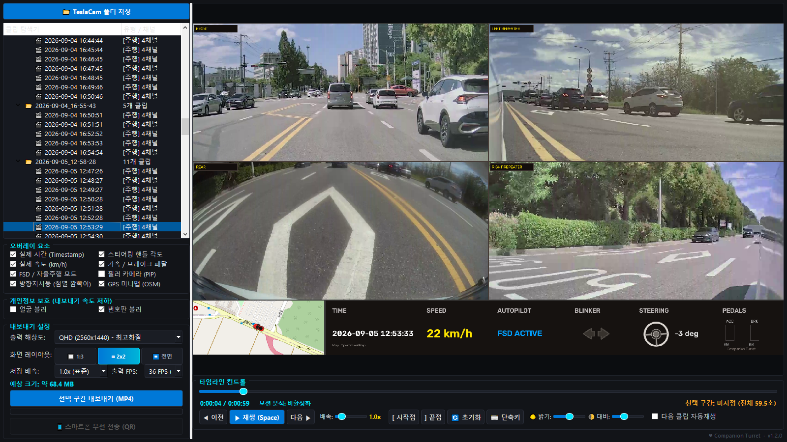
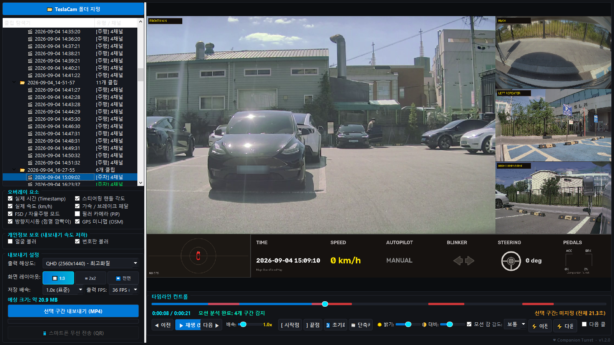
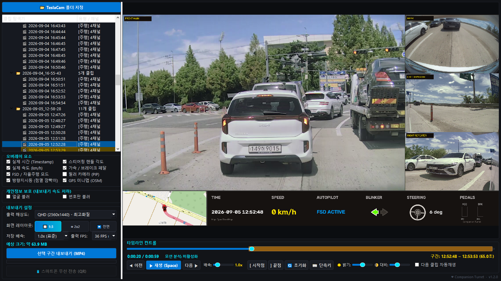
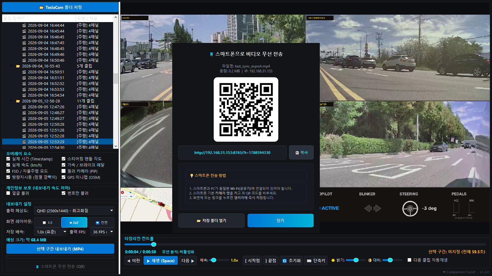

# Tesla Dashcam Studio (CT)

테슬라(Tesla) 대시캠 및 센트리 모드 영상을 다채널로 동시 재생하고, 차량 내장 메타데이터(속도, 스티어링, 페달, FSD 상태 등)를 대시보드 오버레이로 포함하여 원하는 구간만 MP4로 내보낼 수 있는 뷰어 겸 렌더링 툴입니다.

---

## 💡 주요 기능

* **다채널 통합 화면 구성**: 전방 메인, 후방, 좌/우 리피터 및 필러(PiP) 카메라 영상을 한 화면에 최적 레이아웃으로 배치
* **차량 메타데이터(SEI) 실시간 디코딩 & 오버레이**:
  * 실제 주행 속도 (`km/h`)
  * 스티어링 휠 회전 각도 (`deg`)
  * 가속 / 브레이크 페달 입력 비율 (`%`)
  * 방향지시등(점멸 깜빡이) 동작 상태
  * 오토파일럿 / FSD / TACC 작동 모드
* **GPS 미니맵 (OpenStreetMap) 연동**: 주행 및 주차 위치를 미니맵 레이더 형태로 실시간 오버레이
* **센트리(Sentry) 모션 스캐닝**: 주차 모드 영상의 움직임을 자동으로 분석하여 이벤트 발생 구간 감지 및 하이라이트
* **고화질/배속 MP4 내보내기**:
  * QHD (2560x1440), FHD (1920x1080), HD, Compact 해상도 지원
  * 0.5x ~ 5.0x 저장 배속 및 맞춤형 프레임레이트(FPS) 지정
  * 원하는 시작점(`[`)과 끝점(`]`) 구간 선택 내보내기 (최대 30분)





---

## 🚀 사용 방법

### 1. 실행 파일(.exe) 이용
* 우측 **Releases** 메뉴에서 최신 버전의 `Tesla_Dashcam_Studio.exe` 파일 다운로드 후 바로 실행합니다.

### 2. 소스코드 직접 실행
파이썬 환경이 구축되어 있다면 소스코드를 다운로드받아 직접 실행할 수 있습니다.

## 🛡️ 바이러스 검사 결과 (VirusTotal)

PyInstaller로 패키징된 실행 파일 특성상, 일부 백신에서 휴리스틱 오탐(False Positive)이 발생할 수 있습니다. 현재 검사 결과는 다음과 같습니다.

* **검사 결과**: [VirusTotal 상세 보기 (1/70)](https://www.virustotal.com/gui/file/6b82fbe507fb196c3f1facae92c93c13008cbbcb08e829844f439ae7dc9a152d?nocache=1)
* **상세 내용**: 주요 백신 엔진 69개는 모두 안전(Clean)으로 판독하였으며, `Bkav Pro` 단일 엔진에서만 오탐이 발생했습니다. 
* **결론**: 본 실행 파일은 악성 행위를 포함하지 않는 정상적인 프로그램입니다. 불안하신 분들은 GitHub에 공개된 **소스코드**를 직접 검증하거나 파이썬 환경에서 실행하시길 권장합니다.
  
```bash
# 필수 라이브러리 설치
pip install pyqt6 opencv-python numpy pillow

# 프로그램 실행
python main.py


