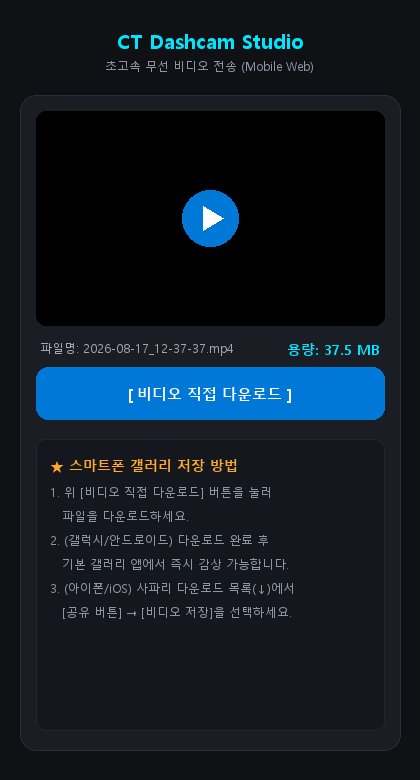

# ⚡ CT Dashcam Studio (TeslaCam Multi-Cam & Telemetry Studio)

<div align="center">


**테슬라(Tesla / Cybertruck) 순정 블랙박스(TeslaCam / Sentry Mode)의 멀티캠 영상과<br>H.264 SEI 메타데이터(속도·FSD·스티어링·페달·GPS)를 완벽하게 디코딩하고 시각화하는 고성능 스튜디오입니다.**

[📥 최신 릴리즈 다운로드 (v1.1.1)](https://github.com/mhsong282828221212123123123/CT-dashcam-studio/releases) • [✨ 주요 핵심 기능](#-주요-핵심-기능) • [📸 스크린샷](#-스크린샷-미리보기) • [🚀 빠른 시작](#-빠른-시작-가이드) • [⌨️ 단축키](#-단축키-및-컨트롤-가이드)

</div>

---

## 📸 스크린샷 미리보기

<div align="center">

### 1. 2x2 멀티캠 동기화 재생 & 실시간 텔레메트리 HUD 대시보드


### 2. 센트리 모드(Sentry Mode) 모션 감지 분석 & 타임라인 이벤트 블록


### 3. 절대 시각(dt) 기반 다중 클립 연속 In/Out 구간 선택 & 트리 하이라이트


### 4. 📱 스마트폰 원터치 QR 무선 고속 전송 (Zero-Cable)
| PC 화면 (원터치 QR 생성) | 스마트폰 화면 (모바일 다운로드 웹) |
| :---: | :---: |
|  |  |

</div>

---

## ✨ 주요 핵심 기능

### 🎥 1. 3가지 화면 레이아웃 & 완벽한 멀티캠 동기화
- **🔲 기본 (1:3 세로배치)**: 전방 대형 메인 뷰 + 우측 후방/좌/우 3개 서브 채널 세로 정렬
- **⊞ 2x2 분할 (전후/좌우)**: 전방·후방·좌측·우측을 균등한 4분할 화면으로 직관적 모니터링
- **⏹ 전면 단독 (전방 풀스크린)**: 전방 카메라를 16:9 와이드 풀스크린으로 확장 (PIP 자동 최적화)
- **필러(B-Pillar) 카메라 PIP**: 좌/우 B필러 카메라가 있는 6채널 차량 영상의 경우 코너에 보조 PIP 오버레이 지원

### 📊 2. 테슬라 순정 H.264 SEI 텔레메트리 정밀 계기판 (6종)
별도의 OBD 장비 없이, 테슬라 순정 MP4 비디오 내부의 **SEI(Supplemental Enhancement Information)** 바이너리 메타데이터를 직접 파싱하여 6개 컬럼 계기판에 가로 균등 분배로 표시합니다.
- 🕒 **TIME**: 테슬라 차량 시스템 시계 기준 밀리초 단위 정확한 타임스탬프
- ⚡ **SPEED**: 실시간 주행 속도 (`km/h`)
- 🤖 **AUTOPILOT**: 자율주행 모드 (`MANUAL` / `TACC` / `AUTOPILOT` / `FSD ACTIVE`)
- 🚦 **BLINKER**: 방향지시등 좌/우 점멸 상태 애니메이션
- 🔄 **STEERING**: 스티어링 휠 조향 각도 그래픽 게이지 (`deg`)
- 🦶 **PEDALS**: 가속 페달(ACC %) 및 브레이크(BRK) 작동 실시간 게이지

### 🗺️ 3. 테슬라 벡터 마커가 탑재된 정밀 GPS 미니맵
- 비디오에 기록된 GPS 위도/경도/방위각(Heading)을 OpenStreetMap(OSM) 타일과 실시간 결합.
- 차량의 실제 이동 궤적 및 주행 방향에 따라 **실시간으로 부드럽게 회전하는 테슬라 전용 벡터 아이콘**을 렌더링합니다.

### 🔍 4. 센트리 모드(Sentry Mode) AI 모션 분석기 & 프리셋
- 주차 중 발생한 수십 분 분량의 영상에서 **차량 접근, 문콕, 보행자 통과 등 움직임 발생 구간을 자동 탐지**.
- 타임라인 컨트롤룸에 **빨간색 이벤트 블록**으로 표시되며, `[⚡ 이전] / [⚡ 다음]` 원클릭 퀵 점프로 즉시 확인할 수 있습니다.
- **감도 조절 프리셋**: `낮음` / `보통` / `높음` / `매우높음` 4단계 지원.

### ✂️ 5. 절대 시각(dt) 기반 다중 클립 연속 In/Out 구간 선택 & 트리 하이라이트
- 1분 단위로 쪼개진 테슬라 파일의 한계를 넘어, **1번 클립의 40초부터 3번 클립의 20초까지 연속된 구간을 한 번에 선택**.
- 선택된 시간 범위에 포함되는 트리 탐색기 상의 클립들이 **골드(황금색)로 자동 하이라이트**되어 편집 범위를 한눈에 파악할 수 있습니다.

### 💾 6. 288케이스 실측 매트릭스 기반 정밀 예상 용량 계산
- 3개 레이아웃 × 4개 해상도 × 가변 배속 × 오버레이 옵션의 **288가지 실측 인코딩 데이터 테이블**을 내장.
- 내보내기 버튼 클릭 전, 생성될 MP4 파일의 크기(MB)를 높은 정확도로 사전 안내합니다.

### 🎬 7. 고효율 FFmpeg libx264 렌더링 엔진 & 원클릭 폴더 열기
- 고화질 저용량 `libx264 (CRF 26, Preset Fast)` 파이프라인으로 무손실에 가까운 압축 인코딩.
- **해상도 프리셋**: QHD (2560x1440), FHD (1920x1080), HD (1280x720), 모바일용 Compact (960x540).
- **출력 가변 배속**: 0.5x (슬로우) ~ 5.0x (5배속 고속) 지원.
- 렌더링 완료 시 결과 파일이 선택된 채로 윈도우 탐색기가 열리는 **[📁 저장 폴더 열기]** 지원.

### 📱 8. 스마트폰 원터치 QR 무선 고속 전송 (Zero-Cable)
- USB를 뽑아 PC와 폰을 오갈 필요 없이, 내장 초경량 스트리밍 서버 구동.
- **스마트폰 기본 카메라로 화면의 QR 코드만 스캔하면 모바일 브라우저에서 즉시 스트리밍 및 갤러리 다운로드**.
- 3중 캐시 방지(No-Cache 헤더 및 타임스탬프 쿼리)가 적용되어 새로 내보낸 영상을 캐시 꼬임 없이 실시간 갱신합니다.

### ☀️ 9. 실시간 밝기 & 대비(Contrast) 듀얼 게이지
- 어두운 틴팅(썬팅)이나 야간 주행 영상도 직관적인 슬라이더 조절로 환하고 선명하게 보정.
- 일시정지 상태에서도 프레임이 튀지 않고 프리뷰와 최종 렌더링에 즉시 동기화 반영됩니다.

### ⏯️ 10. 다음 클립 자동재생 토글 & 끊김 없는 연속 시청
- `다음 클립 자동재생` 체크박스를 통해 단일 클립 시청 후 정지 또는 다음 클립 즉시 연속 재생을 자유롭게 선택.
- 클립을 수동으로 전환하더라도 자동재생 설정이 안전하게 유지됩니다.

---

## 🚀 빠른 시작 가이드

### 방법 1. 포터블 무설치 실행 (가장 추천 ⭐)
> 파이썬이나 외부 코덱 설치 없이 압축만 풀면 즉시 실행할 수 있는 독립형 패키지입니다.

1. [Releases 페이지](https://github.com/mhsong282828221212123123123/CT-dashcam-studio/releases)에서 최신 `v1.1.1` 압축 파일(`CT_Dashcam_Studio_v1.1.1_Portable.zip`) 또는 `CT_Dashcam_Studio.exe`를 다운로드합니다.
2. 다운로드한 파일의 압축을 풀고 `CT_Dashcam_Studio.exe`를 실행합니다.
3. 좌측 상단 **[📁 TeslaCam 폴더 지정]** 버튼을 눌러 USB의 `TeslaCam` 폴더를 선택하면 모든 영상이 트리 구조로 로드됩니다.

---

### 방법 2. 파이썬 소스코드에서 실행

```bash
# 1. 저장소 클론
git clone https://github.com/mhsong282828221212123123123/CT-dashcam-studio.git
cd CT-dashcam-studio

# 2. 필수 라이브러리 설치
pip install PyQt6 opencv-python numpy Pillow qrcode imageio-ffmpeg

# 3. 애플리케이션 실행
python CT_Dashcam_Studio.py
```

---

## ⌨️ 단축키 및 컨트롤 가이드

| 기능 | 단축키 / 버튼 | 설명 |
| :--- | :--- | :--- |
| **재생 / 일시정지** | `Spacebar` / `▶ 재생` | 현재 영상을 실시간으로 재생하거나 일시정지 |
| **1초 앞/뒤 이동** | `◀` / `▶` (방향키) | 현재 프레임 기준 1초 전/후로 이동 |
| **5초 앞/뒤 이동** | `Shift + ◀` / `Shift + ▶` | 현재 프레임 기준 5초 전/후로 고속 탐색 |
| **처음으로 이동** | `Home` | 현재 클립의 첫 번째 프레임(0초)으로 즉시 이동 |
| **이전 / 다음 클립** | `[` / `]` | 트리 탐색기 상의 이전 / 다음 영상으로 전환 |
| **구간 시작점 지정** | `[ 시작점 ]` 버튼 | 현재 프레임 시각을 편집 시작점으로 지정 |
| **구간 끝점 지정** | `[ 끝점 ]` 버튼 | 현재 프레임 시각을 편집 종료점으로 지정 |
| **구간 초기화** | `[ ↺ 초기화 ]` 버튼 | 설정된 구간 및 트리 하이라이트를 모두 초기화 |
| **모션 이벤트 퀵 점프**| `⚡ 이전` / `⚡ 다음` | 센트리 감지된 모션 구간으로 1초 만에 이동 |
| **단축키 안내** | `⌨ 단축키` 버튼 | 전체 키보드 단축키 모달 다이얼로그 호출 |
| **스마트폰 QR 공유** | `📱 스마트폰 무선 전송` | 모바일 Wi-Fi 다운로드용 QR 모달 팝업 열기 |

---

## 🛠️ 기술 스택 & 아키텍처

- **GUI Framework**: PyQt6 (Fusion Dark Theme & Custom Cyber-Dashboard UI)
- **Computer Vision**: OpenCV (OpenCL 하드웨어 가속, 프레임 차분 모션 감지 알고리즘)
- **Video Codec**: FFmpeg `libx264` (Raw Video Pipe Stream, CRF Rate Control, YUV420p)
- **Telemetry Parser**: Tesla H.264 NAL SEI Binary Parser & Protocol Buffers Wire Type Engine
- **Map System**: OpenStreetMap XYZ Tile Caching Engine with Vector Vehicle Transformation
- **Wireless Share**: Python Native Threading HTTP Server (No-Cache 3중 방어 적용) & Responsive Mobile Web

---

## 📄 라이선스 (License)

본 프로젝트는 [LICENSE](LICENSE)에 명시된 오픈소스 라이선스를 따릅니다.

---

<div align="center">
  <sub>Developed with ❤️ for Tesla & Cybertruck Owners worldwide.</sub>
</div>
