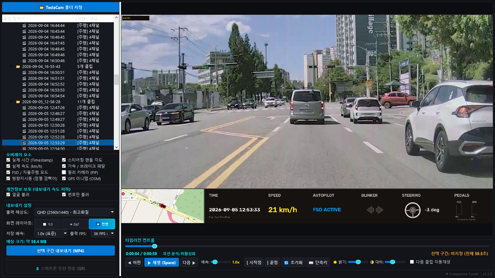

# ⚡ CT Dashcam Studio

<div align="center">


**테슬라(Tesla) 순정 블랙박스 및 센트리 모드 영상을 위한 멀티캠 뷰어 & 텔레메트리 스튜디오**

[📥 다운로드 (v1.2.0)](https://github.com/mhsong282828221212123123123/CT-dashcam-studio/releases) • [주요 기능](#-주요-기능) • [스크린샷](#-스크린샷) • [사용 방법](#-사용-방법) • [단축키](#-단축키)

</div>

---

## 📸 스크린샷

<div align="center">

| 2x2 멀티캠 & 텔레메트리 HUD | 센트리 모드 모션 감지 |
| :---: | :---: |
|  |  |

| 다중 클립 연속 구간 편집 | AI 번호판 & 안면 블러 |
| :---: | :---: |
|  |  |

| PC 원터치 QR 생성 | 스마트폰 다운로드 웹 |
| :---: | :---: |
|  |  |

</div>

---

## ✨ 주요 기능

- 🎥 **멀티캠 동기화 재생**: 전방·후방·좌·우 4채널 동시 재생 (1:3 / 2x2 / 전면 단독 레이아웃)
- 📊 **실시간 텔레메트리 HUD**: 주행 데이터(속도, FSD 상태, 방향지시등, 조향각, 가속/브레이크 페달) 시각화
- 🗺️ **GPS 미니맵**: 차량 이동 궤적 및 주행 방향 실시간 연동 지도
- 🛡️ **AI 개인정보 보호**: 차량 번호판 및 얼굴 자동 인식 모자이크 (유튜브/커뮤니티 공유용)
- 🔍 **센트리 모션 감지**: 주차 중 이벤트 구간 자동 탐지 및 타임라인 퀵 점프
- ✂️ **다중 클립 연속 편집**: 여러 클립을 하나로 이어붙여 원하는 구간만 MP4로 내보내기
- 📱 **스마트폰 QR 무선 전송**: 케이블 없이 화면의 QR 코드 스캔으로 폰에서 즉시 다운로드
- ☀️ **화면 보정 & 배속**: 야간/틴팅 영상을 위한 밝기·대비 조절 및 가변 배속 재생

---

## 🚀 사용 방법

### 포터블 무설치 실행 (추천)
1. [Releases](https://github.com/mhsong282828221212123123123/CT-dashcam-studio/releases)에서 `CT_Dashcam_Studio_v1.2.0_Portable.zip` 다운로드 후 압축 해제
2. `CT_Dashcam_Studio.exe` 실행
3. 좌측 상단 **[📁 TeslaCam 폴더 지정]** 버튼으로 USB의 `TeslaCam` 폴더 선택

### 파이썬 환경에서 실행
```bash
git clone https://github.com/mhsong282828221212123123123/CT-dashcam-studio.git
cd CT-dashcam-studio
pip install PyQt6 opencv-python numpy Pillow qrcode imageio-ffmpeg
python CT_Dashcam_Studio.py
```

---

## ⌨️ 단축키

| 기능 | 단축키 | 설명 |
| :--- | :--- | :--- |
| **재생 / 일시정지** | `Space` | 영상 재생/정지 |
| **1초 이동** | `◀` / `▶` | 1초 전/후 탐색 |
| **5초 이동** | `Shift + ◀` / `Shift + ▶` | 5초 전/후 고속 탐색 |
| **처음으로** | `Home` | 현재 클립 0초로 이동 |
| **이전 / 다음 클립** | `[` / `]` | 클립 전환 |
| **구간 시작점 / 끝점** | `I` / `O` | 내보낼 구간 설정 |
| **모션 이벤트 이동** | `⚡ 이전` / `⚡ 다음` | 센트리 감지 구간 점프 |
| **단축키 안내** | `F1` 또는 `?` | 단축키 가이드 팝업 |

---

## 📄 라이선스

본 프로젝트는 [MIT LICENSE](LICENSE)를 따릅니다.
